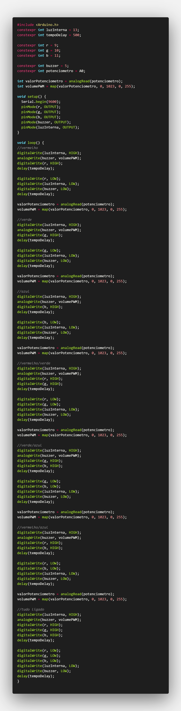
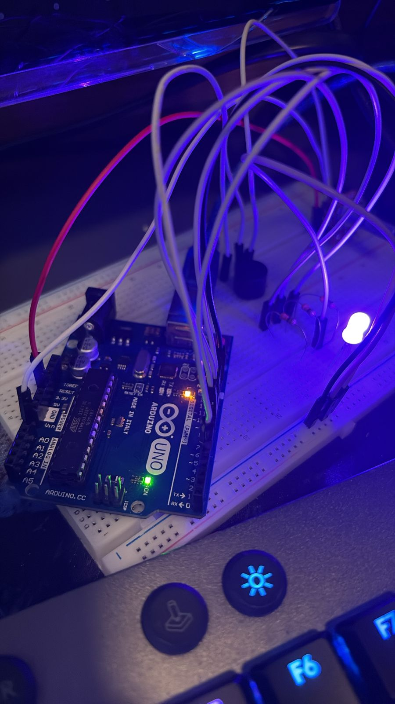

## Parte 1: Blink Led Interno
Instale a Arduino IDE e assista aos vídeos indicados nos autoestudos. Realize o "blink" com o LED interno e poste as evidências no seu GitHub.

**Entrega Parte 1**:
- Screenshot do IDE Arduino
- Screenshot do código
- Foto do Arduino ligado e do LED aceso
- Vídeo do funcionamento (opcional)

------------------------------------------------

### Resposta
- Observação: Acabei fazendo um pouco mais que um blink. Segue o blink com troca de cor usando o LED RGB e um buzzer controlado por um potenciômetro. No video é possivel ver o LED interno piscando.

### Evidências

<i>Vídeo do Arduino funcionando</i>

<video src="assets/Arduino.mp4" width="400" controls></video>

<i>ou clique no link do YouTube: <a href="https://youtube.com/shorts/HXw_AyZCh9c?feature=share">Vídeo no YouTube</a></i>

<i>Snapshot do código</i>

<i>Foto do Arduino com LED aceso</i>

