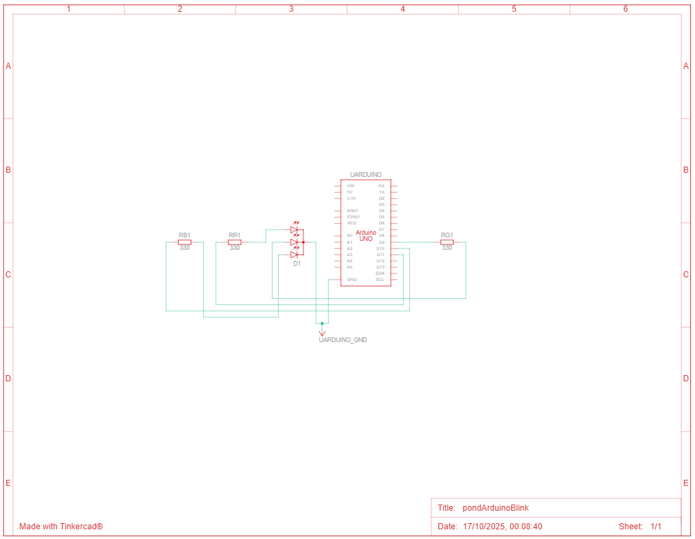
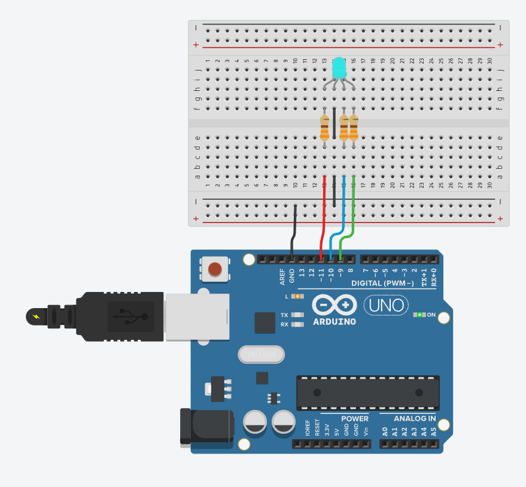

## Parte 2: Simulando Blink Externo
> No TinkerCad, monte um pisca-pisca com Arduino Uno usando protoboard, LED OFF_BOARD, resistor e fiações. Ao clicar em Play, a simulação deve executar sem erros uma cadência à sua escolha. Publique o código do TinkerCad no seu GitHub e envie ambos os links.

**Entrega Parte 2**:
- Link do projeto no TinkerCad
- Screenshot do circuito (protoboard + LED OFF_BOARD + resistor + Arduino Uno)
- Screenshot do código no TinkerCad
- Vídeo curto da simulação (opcional)
- Link do repositório GitHub com o código

----------------------------------------

### Resposta

- Link do TinkerCad: https://www.tinkercad.com/things/dOYTnG2TxB0-pondarduinoblink-yuri-boczar?sharecode=v7SN_IakOlssaEFLxepMV-nOFht8H6gD4HxB-0B1ZUU

### Evidências

<div align="center">
<p><i>Schematic view</i></p>

</div>

<div align="center">
<p><i>Circuito no TinkerCad</i></p>

</div>

### Código que está no tinkercad - mais simples que o que fiz no arduino

```cpp
constexpr int luzInterna = 13;
constexpr int tempoDelay = 500;
constexpr int r = 11;
constexpr int g = 9;
constexpr int b = 10;

void setup() {
  Serial.begin(9600);
  pinMode(r, OUTPUT);
  pinMode(g, OUTPUT);
  pinMode(b, OUTPUT);
  pinMode(luzInterna, OUTPUT);
}

void loop() {
  // vermelho
  digitalWrite(luzInterna, HIGH);
  digitalWrite(r, HIGH);
  delay(tempoDelay);
  digitalWrite(r, LOW);
  digitalWrite(luzInterna, LOW);
  delay(tempoDelay);

  // verde
  digitalWrite(luzInterna, HIGH);
  digitalWrite(g, HIGH);
  delay(tempoDelay);
  digitalWrite(g, LOW);
  digitalWrite(luzInterna, LOW);
  delay(tempoDelay);

  // azul
  digitalWrite(luzInterna, HIGH);
  digitalWrite(b, HIGH);
  delay(tempoDelay);
  digitalWrite(b, LOW);
  digitalWrite(luzInterna, LOW);
  delay(tempoDelay);

  // vermelho + verde
  digitalWrite(luzInterna, HIGH);
  digitalWrite(r, HIGH);
  digitalWrite(g, HIGH);
  delay(tempoDelay);
  digitalWrite(r, LOW);
  digitalWrite(g, LOW);
  digitalWrite(luzInterna, LOW);
  delay(tempoDelay);

  // verde + azul
  digitalWrite(luzInterna, HIGH);
  digitalWrite(g, HIGH);
  digitalWrite(b, HIGH);
  delay(tempoDelay);
  digitalWrite(g, LOW);
  digitalWrite(b, LOW);
  digitalWrite(luzInterna, LOW);
  delay(tempoDelay);

  // vermelho + azul
  digitalWrite(luzInterna, HIGH);
  digitalWrite(r, HIGH);
  digitalWrite(b, HIGH);
  delay(tempoDelay);
  digitalWrite(r, LOW);
  digitalWrite(b, LOW);
  digitalWrite(luzInterna, LOW);
  delay(tempoDelay);

  // todos
  digitalWrite(luzInterna, HIGH);
  digitalWrite(r, HIGH);
  digitalWrite(g, HIGH);
  digitalWrite(b, HIGH);
  delay(tempoDelay);
  digitalWrite(r, LOW);
  digitalWrite(g, LOW);
  digitalWrite(b, LOW);
  digitalWrite(luzInterna, LOW);
  delay(tempoDelay);
}

```
